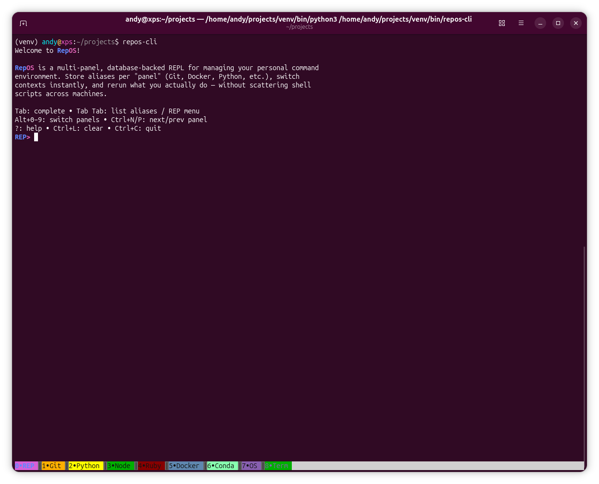
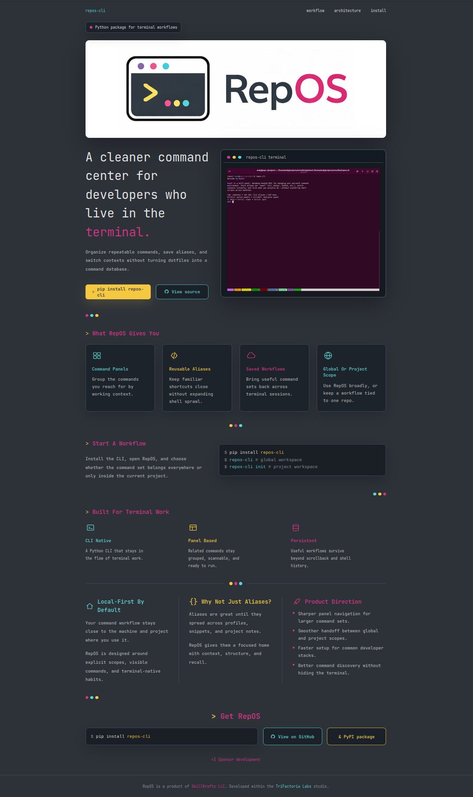

# RepOS Landing Page

Landing page for the `repos-cli` Python package.

RepOS is a terminal-first command workspace designed for developers who live in the shell. It helps organize repeatable commands into panels, persist workflows locally, and reduce shell alias sprawl without turning dotfiles into the source of truth.

This repository contains the public-facing Next.js landing page only.

The actual CLI lives here:

- https://github.com/trifactoria/repos-cli

## Live Site

- https://rep-os.dev

## Related Links

- GitHub: https://github.com/trifactoria/repos-cli
- PyPI: https://pypi.org/project/repos-cli/

## Screenshots

### RepOS Terminal Interface



### Landing Page



## Features

- Multi-panel command organization
- Persistent local workflow storage
- Reusable aliases without shell sprawl
- Global or project-scoped command databases
- Terminal-native workflow design
- Static export deployment

## Development

Install dependencies:

```bash
pnpm install
```

Run development server:

```bash
pnpm dev
```

Build production export:

```bash
pnpm build
```

Run project checks:

```bash
pnpm lint
```

## Stack

- Next.js 15
- React 19
- TypeScript
- Tailwind CSS
- Static export deployment

## Deployment

The site exports statically and can be deployed to:

- Vercel
- Netlify
- GitHub Pages
- Any static hosting provider

Production output is generated in:

```text
out/
```

## Project Structure

```text
repos-landing/
├── app/
│   ├── globals.css
│   ├── layout.tsx
│   └── page.tsx
├── public/
│   ├── logo.png
│   └── screenshots/
├── screenshots/
├── next.config.ts
├── package.json
├── pnpm-lock.yaml
└── tsconfig.json
```

## Design Direction

The landing page intentionally uses:

- terminal-inspired typography
- neon accent colors
- decorative CLI-style separators
- dark workstation aesthetics
- lightweight static delivery

## Notes

- Analytics are optional and environment-gated.
- The site is intentionally static and lightweight.
- `repos-cli` itself is maintained in the separate CLI repository.

## Colors

From the RepOS logo:

| Color   | Hex       | Usage                    |
|---------|-----------|--------------------------|
| Dark    | `#2D3239` | Background               |
| Grey    | `#3D4451` | Buttons, borders         |
| Magenta | `#D63384` | Accent, "OS" text        |
| Cyan    | `#5DD3D3` | Accent, highlights       |
| Yellow  | `#F5C842` | Accent, prompt character |
| Text    | `#E8E8E8` | Primary text             |
| Muted   | `#8B9199` | Secondary text           |

## Fonts

- JetBrains Mono
- Loaded via Google Fonts CDN
